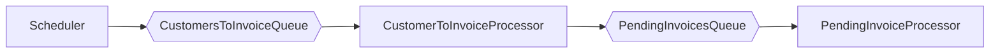

## Antaeus

Antaeus (/ænˈtiːəs/), in Greek mythology, a giant of Libya, the son of the sea god Poseidon and the Earth goddess Gaia. He compelled all strangers who were passing through the country to wrestle with him. Whenever Antaeus touched the Earth (his mother), his strength was renewed, so that even if thrown to the ground, he was invincible. Heracles, in combat with him, discovered the source of his strength and, lifting him up from Earth, crushed him to death.

Welcome to our challenge.

## The challenge

As most "Software as a Service" (SaaS) companies, Pleo needs to charge a subscription fee every month. Our database contains a few invoices for the different markets in which we operate. Your task is to build the logic that will schedule payment of those invoices on the first of the month. While this may seem simple, there is space for some decisions to be taken and you will be expected to justify them.

## Instructions

Fork this repo with your solution. Ideally, we'd like to see your progression through commits, and don't forget to update the README.md to explain your thought process.

Please let us know how long the challenge takes you. We're not looking for how speedy or lengthy you are. It's just really to give us a clearer idea of what you've produced in the time you decided to take. Feel free to go as big or as small as you want.

## Developing

Requirements:
- \>= Java 11 environment

Open the project using your favorite text editor. If you are using IntelliJ, you can open the `build.gradle.kts` file and it is gonna setup the project in the IDE for you.

### Building

```
./gradlew build
```

### Running

There are 2 options for running Anteus. You either need libsqlite3 or docker. Docker is easier but requires some docker knowledge. We do recommend docker though.

*Running Natively*

Native java with sqlite (requires libsqlite3):

If you use homebrew on MacOS `brew install sqlite`.

```
./gradlew run
```

*Running through docker*

Install docker for your platform

```
docker build -t antaeus
docker run antaeus
```

### App Structure
The code given is structured as follows. Feel free however to modify the structure to fit your needs.
```
├── buildSrc
|  | gradle build scripts and project wide dependency declarations
|  └ src/main/kotlin/utils.kt 
|      Dependencies
|
├── pleo-antaeus-app
|       main() & initialization
|
├── pleo-antaeus-core
|       This is probably where you will introduce most of your new code.
|       Pay attention to the PaymentProvider and BillingService class.
|
├── pleo-antaeus-data
|       Module interfacing with the database. Contains the database 
|       models, mappings and access layer.
|
├── pleo-antaeus-models
|       Definition of the Internal and API models used throughout the
|       application.
|
└── pleo-antaeus-rest
        Entry point for HTTP REST API. This is where the routes are defined.
```

### Main Libraries and dependencies
* [Exposed](https://github.com/JetBrains/Exposed) - DSL for type-safe SQL
* [Javalin](https://javalin.io/) - Simple web framework (for REST)
* [kotlin-logging](https://github.com/MicroUtils/kotlin-logging) - Simple logging framework for Kotlin
* [JUnit 5](https://junit.org/junit5/) - Testing framework
* [Mockk](https://mockk.io/) - Mocking library
* [Sqlite3](https://sqlite.org/index.html) - Database storage engine


Happy hacking 😁!


## Solution

### Introduction
Initially it seems to be a simple problem that could be solved with a monolithic approach without many complications.
The monolithic application could be some sort of scheduled application or task that fetch invoices data from
a database and invokes an external component to make a payment. 

However, if we think big and consider that the number of customer can grow very quickly,
then we start realising that monolithic solution could present some limitations. These limitations could be:
- **Scalability:** A monolithic solution could only scale up vertically. This means that at some point it cannot longer 
scale up more or if so it would be extremely expensive.
- **Downtimes:** Everytime that the team needs to deploy a new version it would be required to stop the application
path or deploy the new version and start it again. Perhaps it is not a big deal for the payment system but would be
for the rest API part.

- **Team scalability**: It would be difficult to scale up the dev team as many people working in the same code
base could result in many merge conflicts, many people editing the same components etc. By splitting the solution
in multiple microservices it would be easier to split the big team into smaller teams, each one specialized in
different microservices.


Apart from the above there are many more good reason for choosing a microservice approach where the responsibilities 
are split.

### Microservice solution

The proposed solution consist of the following components that can be run as separated microservices:
- **Rest api:** In charge of exposing invoices information

- **Scheduler:** Is in charge of triggering certain task on a timely basis. The task that this component run should
very lightweight allowing to finish before a new schedule is reached. It is expected not to have many replicas of it.

- **Processors:** Are the components that will do the heavy work. These components will receive chunks of work and will
be in charge of completing them. The intention is to device the task in the smaller chunks as we can and have many replicas
consuming and processing those chunks of work.


### Communication
One of the advantages of having a monolithic solution is the simplicity when we can to communicate different components.
This however gets more complicated when moving into a microservice architecture.

In our case we have two types of component that we want to communicate. The scheduler(s) and the processors. 
Those components will be running in the background and having an asynchronous communication channel is very 
appropriated. They can wait to each other as far as the communication is guarantee. For this reason it is 
proposed a communication using queues. I'm using RabbitMq queues since they are open source and widely used.
On top of that they have great support, a big community and tons of library for pretty much any programming language.
All those makes them a good choice. However, in principle it could be possible to use any other queue technology.


### Workflow

The execution workflow consists as follows:
1. A schedule task runs every month or every amount of time. This calculates the number of customer that should
be checked for pending invoices and send a notification message to the `CustomerToInvoiceProcessor`
2. The `CustomerToInvoiceProcessor` receive messages with a customer information,
get the pending invoices for a particular customer at
 the time and sends them to the `PendingInvoiceProcessor`.
3. The `PendingInvoiceProcessor` receives messages that contain invoices information and invokes the external
component to do the payment. It is important to take into consideration that 
the execution of the payment process might be slow as it requires contacting with the bank etc. which 
involves complex and potentially slow payment protocols. That is the reason why it is expected to have a
high number of `PendingInvoiceProcessor` replicas that can be easily scaled up and down depending on the
amount of work.



