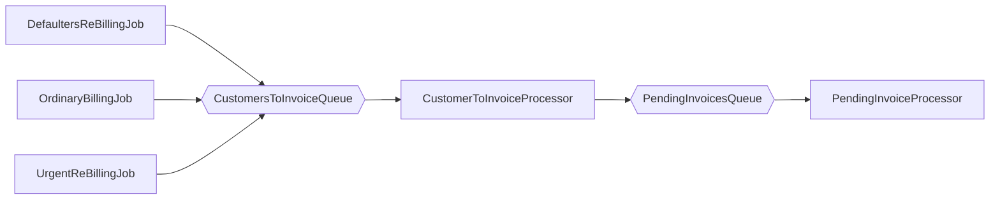

## Antaeus

Antaeus (/ænˈtiːəs/), in Greek mythology, a giant of Libya, the son of the sea god Poseidon and the Earth goddess Gaia. He compelled all strangers who were passing through the country to wrestle with him. Whenever Antaeus touched the Earth (his mother), his strength was renewed, so that even if thrown to the ground, he was invincible. Heracles, in combat with him, discovered the source of his strength and, lifting him up from Earth, crushed him to death.

Welcome to our challenge.

## The challenge

As most "Software as a Service" (SaaS) companies, Pleo needs to charge a subscription fee every month. Our database contains a few invoices for the different markets in which we operate. Your task is to build the logic that will schedule payment of those invoices on the first of the month. While this may seem simple, there is space for some decisions to be taken and you will be expected to justify them.

## Instructions

Fork this repo with your solution. Ideally, we'd like to see your progression through commits, and don't forget to update the README.md to explain your thought process.

Please let us know how long the challenge takes you. We're not looking for how speedy or lengthy you are. It's just really to give us a clearer idea of what you've produced in the time you decided to take. Feel free to go as big or as small as you want.

## Developing

Requirements:
- \>= Java 11 environment

Open the project using your favorite text editor. If you are using IntelliJ, you can open the `build.gradle.kts` file and it is gonna setup the project in the IDE for you.

### Building

```
./gradlew build
```

### Running

There are 2 options for running Anteus. You either need libsqlite3 or docker. Docker is easier but requires some docker knowledge. We do recommend docker though.

*Running Natively*

Native java with sqlite (requires libsqlite3):

If you use homebrew on MacOS `brew install sqlite`.

```
./gradlew run
```

*Running through docker*

Install docker for your platform

```
docker build -t antaeus
docker run antaeus
```

### App Structure
The code given is structured as follows. Feel free however to modify the structure to fit your needs.
```
├── buildSrc
|  | gradle build scripts and project wide dependency declarations
|  └ src/main/kotlin/utils.kt 
|      Dependencies
|
├── pleo-antaeus-app
|       main() & initialization
|
├── pleo-antaeus-core
|       This is probably where you will introduce most of your new code.
|       Pay attention to the PaymentProvider and BillingService class.
|
├── pleo-antaeus-data
|       Module interfacing with the database. Contains the database 
|       models, mappings and access layer.
|
├── pleo-antaeus-messaging
|       Module that contains the messaging specific functionaly. It defines
|       the message processors and publishers
|
├── pleo-antaeus-models
|       Definition of the Internal and API models used throughout the
|       application.
|
└── pleo-antaeus-rest
|        Entry point for HTTP REST API. This is where the routes are defined.
|        
└── pleo-antaeus-scheduling
         Module that contains the scheduling jobs as well as the schedulling mechanism
         
```

### Main Libraries and dependencies
* [Exposed](https://github.com/JetBrains/Exposed) - DSL for type-safe SQL
* [Javalin](https://javalin.io/) - Simple web framework (for REST)
* [kotlin-logging](https://github.com/MicroUtils/kotlin-logging) - Simple logging framework for Kotlin
* [JUnit 5](https://junit.org/junit5/) - Testing framework
* [Mockk](https://mockk.io/) - Mocking library
* [Sqlite3](https://sqlite.org/index.html) - Database storage engine
* [RabbitMq](https://www.rabbitmq.com/) Message broker
* [Quartz](https://www.quartz-scheduler.org/) Job Scheduler


Happy hacking 😁!


## Solution

### Introduction
Initially the task of scheduling the billing of a set of invoices in a timely basis seems to be a simple problem that
could be solved with a monolithic approach without many complications.
The monolithic application could be some sort of scheduled application or task that fetch invoices data from
a database and invokes an external component to make a payment. 

However, if we think big and consider that the number of customer can grow very quickly,
then we start realising that a monolithic solution could present some limitations. These limitations could be:

- **Scalability:** A monolithic solution could only scale up vertically. This means that at some point it cannot longer 
scale up more in terms of hardware requirements or if so it would be extremely expensive.
- 
- **Downtimes:** Everytime that the team needs to deploy a new change it would be required to stop the application
patch or deploy the new version and start it again. Perhaps it is not a big deal for the payment system but would be
for the rest API part since users would be unable to connect to the application for a period of time.

- **Limitation in the team size**: It would be difficult to scale up the dev team as many people working in the same code
base could result in many merge conflicts, many people editing the same components etc. By splitting the solution
in multiple microservices it would be easier to split the big team into smaller teams, each one specialized in
different microservices that deal with different business areas or functionalities.


Apart from the above there are many more good reason for choosing a microservice approach where the responsibilities 
are split.

### Microservice solution

The proposed solution consist of the following components that can be run as separated microservices:

- **Rest api:** In charge of exposing a set of endpoints that allows other systems to interact with the systems 
including a user interface component such as a web page.

- **Scheduler:** Is a microservice in charge of triggering certain task on a timely basis. The tasks that this component
run are very lightweight so that they finish before a new schedule task is reached. It is expected not to have many 
replicas of it.

- **Processors:** Are the components that will do the heavy work. These components receive chunks of work and 
are in charge of completing them. The intention is to divide the work in many small chunks. The system can
spin up many replicas of these consumers and complete these small units of work. This approach makes very easy
to scale up and down the system.

The scheduling and processing components are independent modules. They depend on the business 
layer (pleo-antaeus-core) but not the other way around. The business layer focus only in writing the business
specific logic and know nothing about the processors or the schedulers' behaviour. This is an intentional decoupling.
The scheduling and the processing layer could be easily replaced without having to modify the business layer 
at all. In fact, it could be very likely that the processing layer could use any other queue system such as Kafka etc.
and that would require the replacement of the existing processing project but nothing else.


### Communication
One of the advantages of having a monolithic solution is the simplicity when it comes to communicate the different 
components. This however gets more complicated when moving into a microservice architecture.

In our case we have two types of component that we want to communicate. The schedulers and the processors. 
Those components run in the background and having an asynchronous communication channel is very 
appropriated. They can wait to each other as far as the communication is guarantee. For this reason the proposed solution 
resolves the communication using queues. The proposed technology is RabbitMq queues since it is an open source solution
that is widely used and have great support. Apart the great support, it also has a big community behind and
tons of libraries for pretty much any programming language.

Although as mentioned rabbitMq is a good choice for our solution, in principle it could be possible to use any other
queue technology without having to change the architecture, probably just the messaging project.


### Workflow
The solution can be seen as a workflow composed for a series of tasks:

1. Three schedule task that runs on a timely basis. These schedules determine a list of customer for which there 
some invoices pending to be paid. Then the information for these customers is sent to the `CustomerToInvoiceProcessor`.

2. The `CustomerToInvoiceProcessor` receive messages with customers information, one at the time, 
get the pending invoices for each customer at and sends them to the `PendingInvoiceProcessor`.

3. The `PendingInvoiceProcessor` receives messages that contain a list of invoices information for a particular customer,
and invokes and external service to do the payment. It is important to take into consideration that 
the execution of the payment process might be slow as it requires contacting with the bank etc. This 
involves complex and potentially slow payment protocols. That is the reason why it is expected to have a
high number of `PendingInvoiceProcessor` replicas that can be easily scaled up and down depending on the
amount of pending work in a given moment.




## Use of interfaces
In order to decouple the different components (providers), it is preferred to use interfaces to define the contract of 
the different components. So dependencies are based on interfaces rather than in actual implementations (inversion of control). 

## Async programming
Methods such as `charge` in the `PaymentProvider` are expected to be slow are expected to be suspended. Because of that
they have been implement using Coroutines. They can potentially be suspended, however with this
approach the execution of the processor thread can continue processing another invoices in the batch while the charge
method is suspended or waiting to be completed.

For real live projects all methods that make network request, database accesses 
etc. that could potentially suspend the execution thread should use this kind of async pattern.

## TODO
Next there is a list of improvements that would need to be improved/included if this would be real project
before it could be production ready: 

- Run api, scheduler and consumer each one in a separate app so that they can
  be containerized separately and therefore run as a separate services with the benefit that they
  can scale up/down independently.

- The config classes such as `SchedulerConfiguration` or `MessagingConfiguration` should be set
during the application startup. The configuration could be loaded from config files for example or any other
mechanism such as a config server etc.

- Add unit testing to the different scheduler jobs to check that the message emitted
  is the expected one based on the job type
- Add unit testing to the processors to verify that they invoke the correct method in the Billing service on each scenario
- Review the way that the connection to the rabbitmq is established to check if there
could be done more efficiently so that it could be reused when sending multiple messages in the same a batch.
- Replace factories by a dependency container such as Kodein-DI
